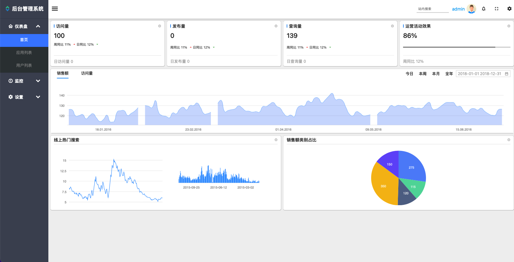
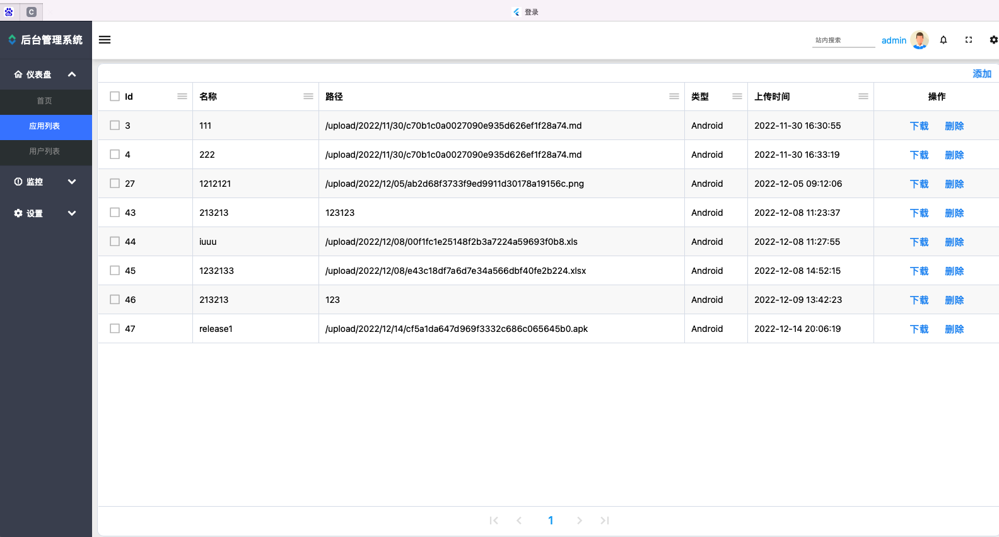
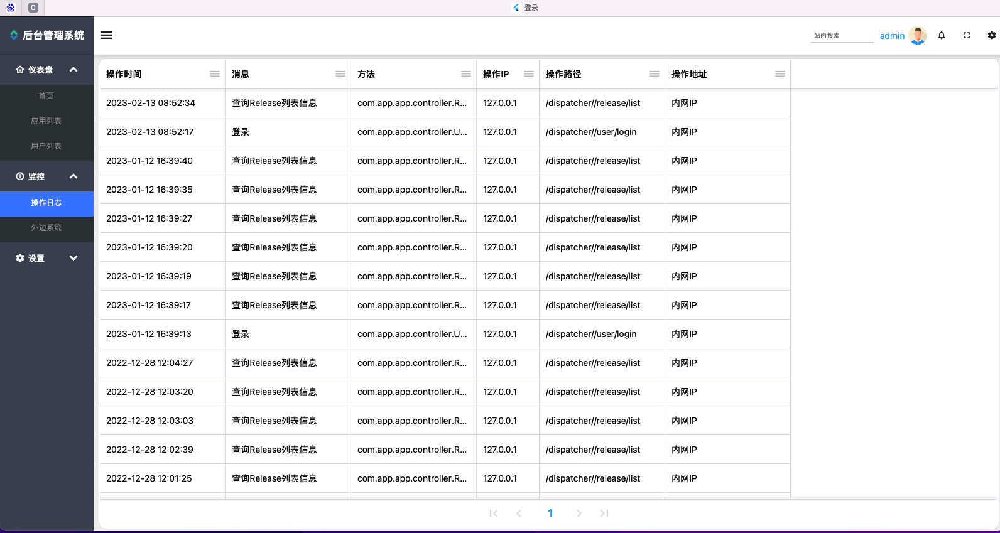

# app_dispatcher

本项目是基于flutter+spring boot开发，支持数据/文件保存与查询，目前可以满足大部分需求场景，因功能较简单，可作为脚手架使用，需要再次开发，不支持直接商用。

环境

```shell
[✓] Flutter (Channel stable, 3.3.10, on macOS 13.0 22A380 darwin-x64, locale zh-Hans-CN)
    • Flutter version 3.3.10 on channel stable at /Users/xx/fvm/versions/3.3.10
    • Upstream repository https://github.com/flutter/flutter.git
    • Framework revision 135454af32 (8 weeks ago), 2022-12-15 07:36:55 -0800
    • Engine revision 3316dd8728
    • Dart version 2.18.6
    • DevTools version 2.15.0
    • Pub download mirror https://pub.flutter-io.cn
    • Flutter download mirror https://storage.flutter-io.cn


[✓] Xcode - develop for iOS and macOS (Xcode 14.2)
    • Xcode at /Applications/Xcode.app/Contents/Developer
    • Build 14C18
    • CocoaPods version 1.11.3

[✓] Chrome - develop for the web
    • Chrome at /Applications/Google Chrome.app/Contents/MacOS/Google Chrome

[✓] Android Studio (version 2021.2)
    • Android Studio at /Applications/Android Studio.app/Contents
    • Flutter plugin can be installed from:
      🔨 https://plugins.jetbrains.com/plugin/9212-flutter
    • Dart plugin can be installed from:
      🔨 https://plugins.jetbrains.com/plugin/6351-dart
    • Java version OpenJDK Runtime Environment (build 11.0.12+0-b1504.28-7817840)


```







### 现有功能

1、登录

1、首页 

6、应用列表

7、日志

8、设置
