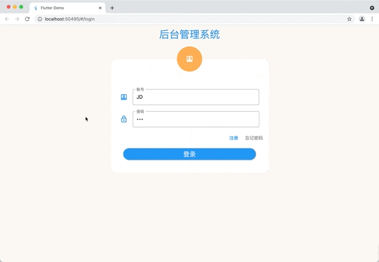
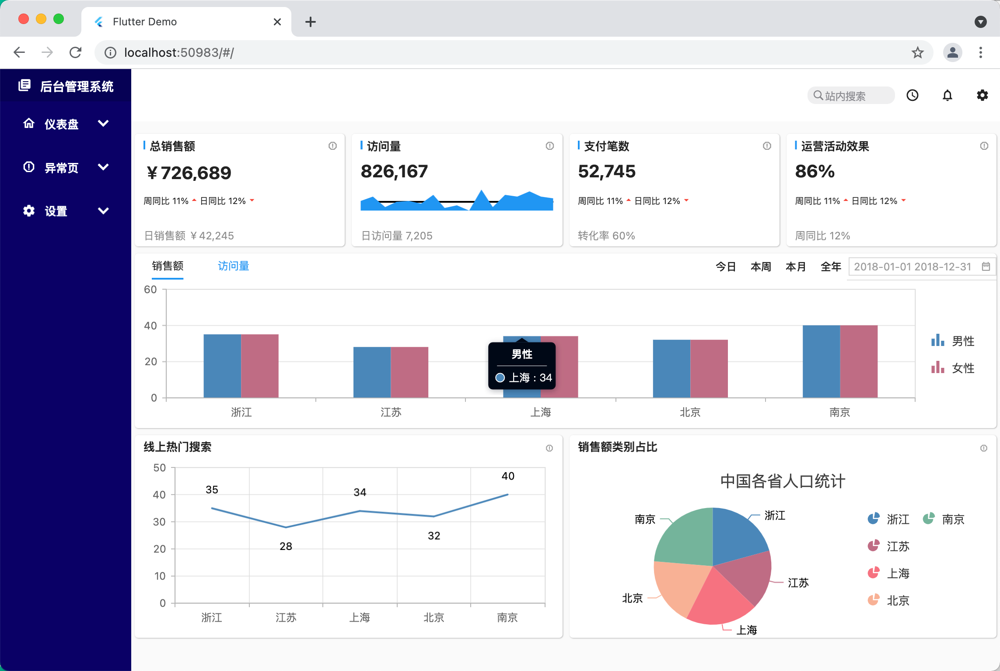

# flutter_admin_universal

后台管理系统

## Getting Started







**使用的组件：**

自研ResizeWidget 组件：内部区域使用MouseRegion识别鼠标，然后GestureDetector的pan手势进行大小拖拽

第三方bitsdojo_window组件：可对窗口进行最大最小设置，设置window风格等，可参照swift代码中的NSWindow


**开发环境**

```
[✓] Flutter (Channel unknown, 2.8.1, on macOS 12.0 21A5543b darwin-x64, locale zh-Hans-CN)
    • Flutter version 2.8.1 at /Users/jd/Documents/sdk/flutter/flutter
    • Upstream repository unknown
    • Framework revision 77d935af4d (9 天前), 2021-12-16 08:37:33 -0800
    • Engine revision 890a5fca2e
    • Dart version 2.15.1
    • Pub download mirror https://pub.flutter-io.cn
    • Flutter download mirror https://storage.flutter-io.cn
[✓] Xcode - develop for iOS and macOS (Xcode 13.0)
    • Xcode at /Applications/Xcode.app/Contents/Developer
    • CocoaPods version 1.11.2

[✓] Chrome - develop for the web
    • Chrome at /Applications/Google Chrome.app/Contents/MacOS/Google Chrome
```

