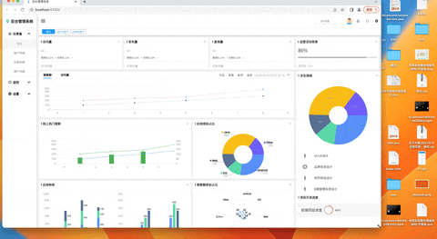

# flutter_admin_universal

https://jdongkhan.github.io/flutter_admin_universal/web/

本项目是基于flutter+spring boot开发，支持数据/文件保存与查询，目前可以满足大部分需求场景，因功能较简单，可作为脚手架使用，需要再次开发，不支持直接商用。

环境

```shell
/Users/jd/fvm/default/bin/flutter doctor --verbose
[✓] Flutter (Channel stable, 3.19.5, on macOS 14.4 23E214 darwin-arm64, locale zh-Hans-CN)
    • Flutter version 3.19.5 on channel stable at /Users/jd/fvm/versions/3.19.5
    • Upstream repository https://github.com/flutter/flutter.git
    • Framework revision 300451adae (7 周前), 2024-03-27 21:54:07 -0500
    • Engine revision e76c956498
    • Dart version 3.3.3
    • DevTools version 2.31.1
    • Pub download mirror https://pub.flutter-io.cn
    • Flutter download mirror https://storage.flutter-io.cn

[!] Android toolchain - develop for Android devices (Android SDK version 34.0.0)
    • Android SDK at /Users/jd/Documents/sdk/android-sdk-macosx
    ✗ cmdline-tools component is missing
      Run `path/to/sdkmanager --install "cmdline-tools;latest"`
      See https://developer.android.com/studio/command-line for more details.
    ✗ Android license status unknown.
      Run `flutter doctor --android-licenses` to accept the SDK licenses.
      See https://flutter.dev/docs/get-started/install/macos#android-setup for more details.

[✓] Xcode - develop for iOS and macOS (Xcode 15.3)
    • Xcode at /Applications/Xcode.app/Contents/Developer
    • Build 15E204a
    • CocoaPods version 1.15.2

[✓] Chrome - develop for the web
    • Chrome at /Applications/Google Chrome.app/Contents/MacOS/Google Chrome

[✓] Android Studio (version 2023.2)
    • Android Studio at /Applications/Android Studio.app/Contents
    • Flutter plugin can be installed from:
      🔨 https://plugins.jetbrains.com/plugin/9212-flutter
    • Dart plugin can be installed from:
      🔨 https://plugins.jetbrains.com/plugin/6351-dart
    • Java version OpenJDK Runtime Environment (build 17.0.9+0-17.0.9b1087.7-11185874)

[✓] IntelliJ IDEA Community Edition (version 2021.2.4)
    • IntelliJ at /Applications/IntelliJ IDEA CE.app
    • Flutter plugin can be installed from:
      🔨 https://plugins.jetbrains.com/plugin/9212-flutter
    • Dart plugin version 212.5744

[✓] VS Code (version 1.89.1)
    • VS Code at /Applications/Visual Studio Code.app/Contents
    • Flutter extension can be installed from:
      🔨 https://marketplace.visualstudio.com/items?itemName=Dart-Code.flutter


```




### 现有功能

1、登录

1、首页 

6、应用列表

7、日志

8、设置
